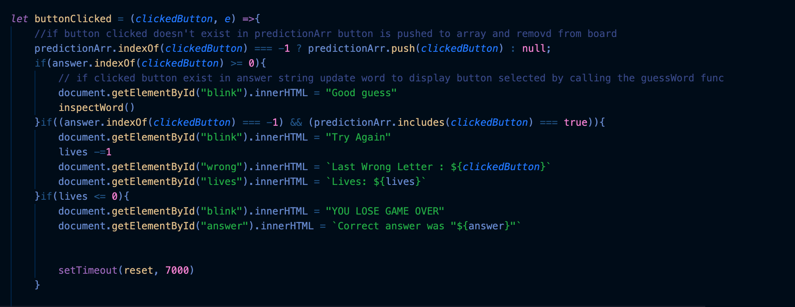

# Guesstimate

---

[Guessitmate](https://dross3121.github.io/Ross-Guesstimate/) is a single page gaming application. that allows a user ten chances to guess the hidden random word correctly. 

## Technology used
- Javascript
- HTML
- CSS
---
## Installtion Instructions
- Fork this repository
- requires Node.js v14.16.0. or later
- HTML 5 

---

## Wireframes
[Google Doc of wireframe](https://docs.google.com/document/d/1sDWWR4G57eXfvCDN2fk3K1ZAthn2AzUCIkTu5LJbSKU/edit?usp=sharing)
---
## User Stories
- As a creator, I want to able to have users guess words based on difficulty , so that there is a difficulty setting easy medium and hard.
- As a creator, I want limit the amount of incorrect guesses , so that the game will end if the user depletes the allot amount of chances.
- As a creator, I want the user to be able to guess the word if they know the correct answer
- As a creator , I want display the letters on the window, so that the user knows their options.
- As a user, I want have the lives displayed, so that i know how many incorrect guess i have.

---

## Add-ons
- Third party Api to render random image related to category
- auto filler function added to hint button to fill in A hidden space randomly 

---
## Hurdles
- working through how I needed to pass my event listner an argument so that it was able to check that the argument against the hidden word ex:

- having to re-evaulate my appoarch so my code logic made sense to someone readin my code
- having code that can easily be reusable for futurre projects and can be scaled up if needed or scalled down
- making guesstimate mobile friendly was a big deal to me because most people play games on they phones or tablets
